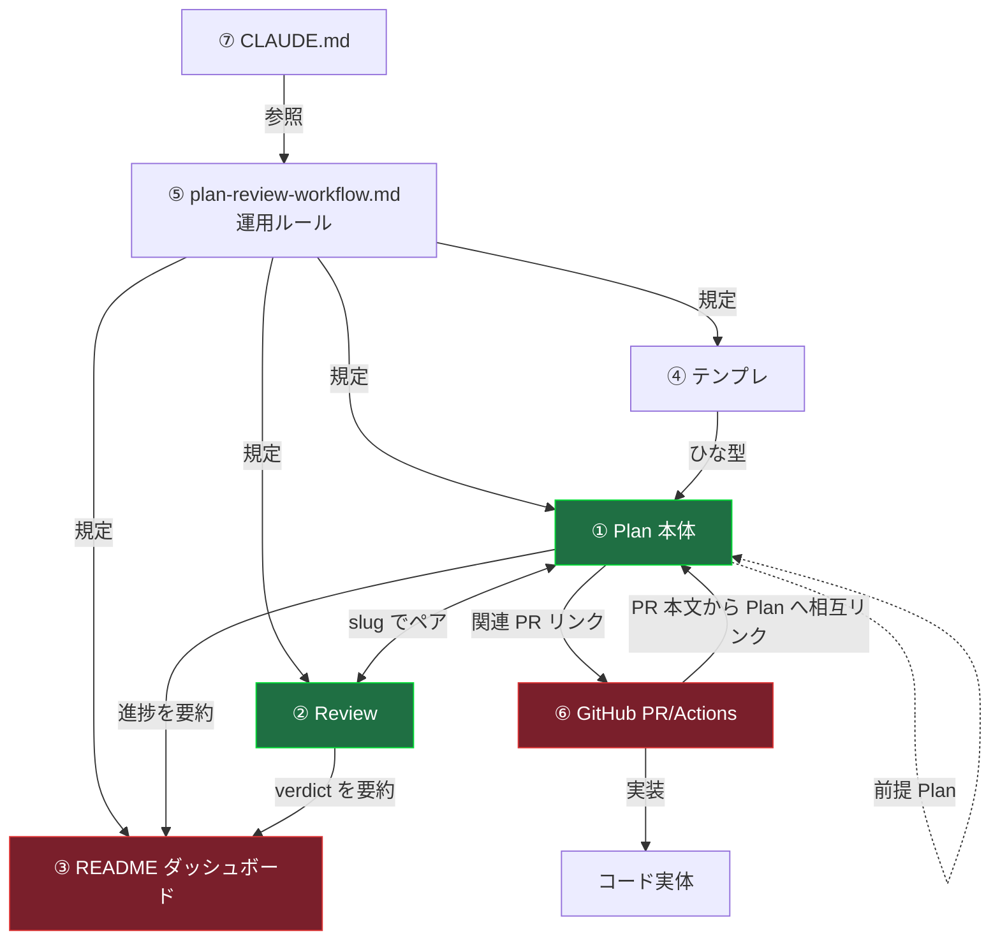

# Step 1: 現状整理（as-is）— トップ

> 目的: outputs 文書体系の現状を、**確からしさを追える生データから**整理する。
> 二つの見方で分解する:
> - 【ドキュメント軸】各文書は何のためにあり、何を持ち、その情報はどう変化するか → [01a-by-document.md](01a-by-document.md)
> - 【情報軸】各情報はどこが一次ソースであるべきで、現状どこに重複・drift しているか → [01b-by-information.md](01b-by-information.md)（未作成）
>
> 一般論を主とし、drift の**実測の証拠**として urgency-list-display 1 件を使う（01b で扱う予定）。

## 対象ドキュメント（登場人物）

| # | ドキュメント | 実体 | ひとことでの役割 |
|---|---|---|---|
| ① | Plan 本体 | `outputs/plans/YYYY-…-<slug>.md` | 1 作業の計画と意思決定の記録 |
| ② | Review | `outputs/reviews/YYYY-…-<slug>-review.md` | 1 作業のレビュー判定と指摘 |
| ③ | README ダッシュボード | `outputs/README.md` | 全 Plan の進捗一覧（索引） |
| ④ | Plan テンプレ | `outputs/plans/_template.md` | Plan のひな型（`reviews/_template.md` は欠落） |
| ⑤ | 運用ルール | `.claude/rules/plan-review-workflow.md` ほか | 上記すべての書き方・遷移の規定 |
| ⑥ | GitHub | PR / Actions / branch | 実装差分・CI・マージ状態の実体 |
| ⑦ | CLAUDE.md | ルート | セッション常時投入。rules へのリンク元 |

## ドキュメント関係のネットワーク図

> 緑＝意思決定の一次ソースを持つ / 赤＝揮発情報が集まり drift しやすい結節点。
> エッジのラベル（規定 / ひな型 / ペア / 要約 / リンク / 実装）が「情報がどう流れ、どこでコピーされるか」を示す。
> **「要約」と付いたエッジ（Plan→README, Review→README）が二次コピーの発生点**であり、
> drift はこの矢印の上で起きる。

## 情報の3層（この体系の背骨）

現状を貫く軸は「情報の変化速度」。ここが設計の核になる:

| 層 | 例 | 変化速度 | 本来の置き場 |
|---|---|---|---|
| **不変層** | 意思決定の理由・Goal・Scope・判断ログ | 実装完了でほぼ凍結 | ① Plan 本体 |
| **揮発層** | フェーズ状態・PR 番号・verdict・CI 結果 | 作業中に何度も変わる | ⑥ GitHub / ③ README |
| **スナップ層** | 現状コンテキスト（実装前の既存コード） | 実装後に陳腐化 | ① Plan（ただし要注意） |

現状の不具合は、ほぼすべて **「揮発層の情報を ① Plan 本体に手書きコピーしている」** ことから来る（詳細は 01b）。
なお、この「不変 / 状態機械 / 陳腐化」の精密化は
[thinking-log の design note](../../../docs/thinking-log/2026-07-06-information-properties-and-placement.md) を参照。

## この Step の索引と現在地

- [01a-by-document.md](01a-by-document.md) — ドキュメント軸の評価 ← 作成済み
- [01b-by-information.md](01b-by-information.md) — 情報軸の評価＋生データ ← 未作成

確認したいこと（トップ段階）:
1. 登場人物 ①〜⑦ に過不足はないか（特に ⑦ CLAUDE.md / ⑤ rules を含めた点）
2. ネットワーク図の関係（エッジのラベル）が実態と合っているか
3. **「情報の3層（不変 / 揮発 / スナップ）」という切り口**が、この後の設計軸として妥当か
